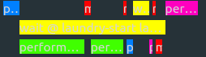

# Temporal Planning with Required Concurrency Using PDDL

## Table of Contents

- [Temporal Planning with Required Concurrency Using PDDL](#temporal-planning-with-required-concurrency-using-pddl)
  - [Table of Contents](#table-of-contents)
  - [About ](#about-)
  - [Getting Started ](#getting-started-)
    - [Prerequisites](#prerequisites)
  - [Usage ](#usage-)

## About <a name = "about"></a>

The Temporal Planning; PDDL Example which allow concurrency between tasks.

## Getting Started <a name = "getting_started"></a>
install planutils and use OPTIC solver. then, clone this code.

### Prerequisites

<a href="https://marketplace.visualstudio.com/items?itemName=jan-dolejsi.pddl"> install PDDL-vscode</a>

Set up the plan utils

```
pip install planutils
planutils setup
planutils activate
planutils install -y optic
```

Start the planner service.
```
pip install flask

planutils server --port 5555
```

## Usage <a name = "usage"></a>

```
git clone https://github.com/do-dong-park/PDDL.git
cd PDDL
```

solve it!
```
[Alt] + P
select the optic solver
```
then, you can see the concurrency temporal planning result.

